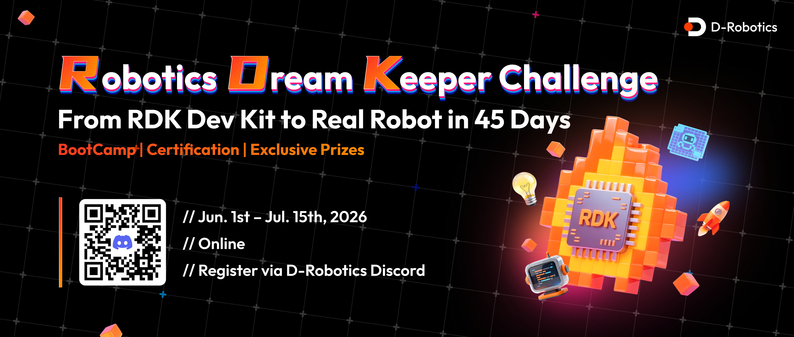

<div align="center">

# **Robotics Dream Keeper Challenge**



**Power on. Build. Launch your intelligent robot on RDK X5.**

</div>

---

## Overview

The **Robotics Dream Keeper Challenge** is a **staged, hands-on robotics program** built around real hardware and production-style delivery. Participants progress from first boot on **D-Robotics RDK X5** to a **complete, demo-ready AI / robotics project** with ROS 2 integration, accelerated inference, and community visibility.

Each stage has a suggested milestone window, but submissions can **roll flexibly** across the full program period. **Complete all 3 stages by July 15, 2026** to be considered as having finished the full program.

**Why join:** You gain structured milestones, **embedded Online Bootcamp** sessions, **weekly office hours / Q&A**, and direct **RDK technical support** from the ecosystem team. You improve system design and on-device AI skills, earn **titles, badges, and awards**, and connect with the global **RDK developer community**.

## How It Works (Three Stages)

| Stage | Name | Focus | Details |
|-------|------|--------|---------|
| **Stage 1** | **Ignite Challenge** | **Goal: Power On Your AI Robot's Brain.** Start from your first contact with **RDK X5** and learn to set up the board, activate sensors, and independently run your first AI demo. | [stages/stage1-ignite.md](./stages/stage1-ignite.md) |
| **Stage 2** | **Build Challenge** | **Goal: Design Your Own Intelligent Robot.** Advance from “running demos” to defining your robot concept, designing the AI system architecture, and building a complete execution plan. | [stages/stage2-build.md](./stages/stage2-build.md) |
| **Stage 3** | **Launch Challenge** | **Goal: Bring Your Robot to Life.** Integrate your full system into a functional, demonstrable, and shareable AI / robotics project with real-time inference and on-device acceleration. | [stages/stage3-launch.md](./stages/stage3-launch.md) |

<!-- <p align="center">
  
  
  
</p> -->

---

## Kick-off / Registration

First, complete the registration stage to officially join the challenge and unlock program support, updates, and benefits:

1. **Join our Discord server:** https://discord.gg/ydVxBpz3vP
2. **Submit the application form:** https://forms.gle/ojG5pRmWXMsM27Vb9
3. **Register for RDK Studio:** https://sso.d-robotics.cc/

These are the essential onboarding steps for all participants before or during the early challenge window.

---

## How to Participate

1. **Create your own GitHub repository** for your code, logs, and experiments.
2. **Complete the challenges** for your current stage and collect the required artifacts (screenshots, videos, links).
3. **Submit a project showcase document** to this official repository by opening a **Pull Request** that adds a file under [`projects/`](./projects/).

**Step-by-step PR guide:** [docs/github-pr-guide.md](./docs/github-pr-guide.md)

**RDK quick reference (aligned with stage skills):** [docs/rdk-guide.md](./docs/rdk-guide.md)

**FAQ:** [docs/faq.md](./docs/faq.md)

---

## Timeline

| Stage | Window | Challenge Goal | Bootcamp / Program Offering |
|-------|--------|----------------|-----------------------------|
| **Sign Up** | **May 14 - June 10, 2026** | Complete registration, join the community, and get ready for the challenge kickoff. | Registration opens on **May 14**. |
| **Stage 1 - Ignite Challenge** | **June 1 - June 10, 2026** | Go from your first time picking up an **RDK X5** to independently running your first on-device AI demo. | **June 2:** Kickoff webinar<br>**June 9:** Office hour / Q&A |
| **Stage 2 - Build Challenge** | **June 11 - June 25, 2026** | Move from running demos to designing your own intelligent robot system, architecture, and project plan. | **June 16:** Themed webinar<br>**June 23:** Office hour / Q&A |
| **Stage 3 - Launch Challenge** | **June 26 - July 15, 2026** | Bring your robot to life with an integrated, demonstrable project and **BPU-accelerated** real-time AI inference. | **June 30:** Show-and-tell webinar<br>**July 7:** Office hour / Q&A |
| **Awards / Closing** | **July 23, 2026** | Celebrate completed projects and share standout work with the broader community. | **July 23:** Global livestream / closing |

**Program note:** These dates define the suggested pacing for each stage, but the challenge supports flexible rolling progress. If you complete **Stage 1**, **Stage 2**, and **Stage 3** by **July 15, 2026**, you will be recognized as having completed the full program.

---

## Honors & Awards

- **Stage Titles:** **RDK Explorer** → **RDK Builder** → **RDK Creator** (see [awards.md](./awards.md)).
- **Special Awards:** **TOP Voice Award** (Communication) and **TOP Creator Award** (Technical & Impact).

---

## Hardware & Purchasing

To participate in the challenge, you will need an **RDK X5** development board and relevant accessories.

- **RDK X5 Purchase Link:** [RDK X5 Purchase Link](https://en.d-robotics.cc/distributor)
- **Optional Accessory List:** [Accessory List](https://d-robotics.github.io/rdk_doc/en/Quick_start/accessory)

---

## Support

| Channel | Link / Contact |
|---------|----------------|
| **Discord** | https://discord.gg/ydVxBpz3vP |
| **Program contact** | developer@d-robotics.cc |
| **Reference samples** | [rdk_model_zoo](https://github.com/D-Robotics/rdk_model_zoo) |

---

## Copyright & Submissions

- **Showcase documents** merged into this repository under `projects/` are contributed for **official program use** (promotion, judging, and archives) under the terms stated in each PR unless otherwise agreed in writing.
- **Source code** in participants’ **personal repositories** remains **owned by the participant** (subject to their own licenses).

---

## Repository Map

```
Robotics-Dream-Keeper-Challenge/
├── README.md
├── awards.md
├── stages/
├── docs/
├── projects/
└── assets/
```

Welcome aboard — we look forward to your demos.
