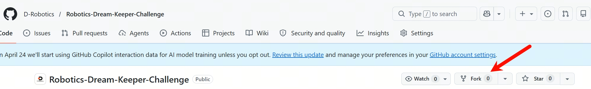

# How to Submit Your Showcase via GitHub Pull Request

This guide walks you from **personal repo** → **showcase Markdown** → **Pull Request (PR)** into the official **`projects/`** folder.

> **Figures:** Replace placeholder images below with real screenshots when you document internally. Paths assume files stored under `docs/images/github-pr-guide/`.

---

## Prerequisites

- GitHub account  
- `git` installed on your computer  
- Completed (or draft) project content in **your own repository**

---

## Step 1 — Fork the Official Challenge Repository

1. Open the official repo in the browser.  
2. Click **Fork** (top-right).



3. Choose your account as destination. Wait until the fork is ready.

---

## Step 2 — Clone **Your Fork** Locally

```bash
git clone https://github.com/<YOUR_USERNAME>/Robotics-Dream-Keeper-Challenge.git
cd Robotics-Dream-Keeper-Challenge
```

Add upstream (optional but recommended):

```bash
git remote add upstream https://github.com/<ORG>/Robotics-Dream-Keeper-Challenge.git
```

Replace `<ORG>` with the official organization or owner name.

---

## Step 3 — Create a Branch

```bash
git checkout -b showcase/<your-github-username>-stage1
```

Use a **short, unique** branch name.

---

## Step 4 — Add Your Showcase File Under `projects/`

### 4.1 Naming Rule (strict)

```
<ParticipantName>-Project-<ProjectSlug>.md
```

**Examples**

- `Tom-Project-RobotVision.md`  
- `AlexLi-Project-HomePatrolBot.md`

Use **ASCII** for the filename to avoid encoding issues.

### 4.2 Copy the Template

Open [projects/README.md](../projects/README.md), copy the **template** block, and save it as your new file.

```bash
# Example
touch projects/Tom-Project-RobotVision.md
```

Edit the file until every **required** field is filled.

---

## Step 5 — Commit and Push

```bash
git add projects/Tom-Project-RobotVision.md
git commit -m "Add showcase: Tom Project RobotVision"
git push origin showcase/<your-github-username>-stage1
```

---

## Step 6 — Open a Pull Request on GitHub

1. Open **your fork** on GitHub.  
2. You should see **Compare & pull request** — click it.  
3. **Base repository:** official org repo → **base branch:** `main` (or announced default).  
4. **Head repository:** your fork → **compare:** your feature branch.

### PR Title Format (recommended)

```
[Showcase] <ParticipantName> — <ProjectName> (Stage X)
```

### PR Description Must Include

- [ ] Participant name (same as in filename)  
- [ ] Stage completed (1 / 2 / 3)  
- [ ] Checklist of deliverables with **links**  
- [ ] Statement: “I agree the showcase document may be used by the program as described in README.md.”

---

## Step 7 — Review & Merge

Maintainers may request changes. **Update the same branch** and push again — the PR updates automatically.

```bash
git add projects/Tom-Project-RobotVision.md
git commit -m "Address review: fix video link"
git push
```

---

## Common Errors

| Problem | Fix |
|---------|-----|
| **Permission denied** on push | Use **SSH key** or **HTTPS personal access token**. |
| **Branch is behind main** | `git fetch upstream` → `git merge upstream/main` (or rebase if you know how). |
| **Wrong folder** | File must live in **`projects/`** root, not subfolders unless organizers say otherwise. |
| **Binary uploads** | Do **not** commit large videos; use **YouTube** or **Release assets** and link them. |

---

## Need Help?

See [faq.md](./faq.md) or ask in **Discord** (link in [README.md](../README.md)).
