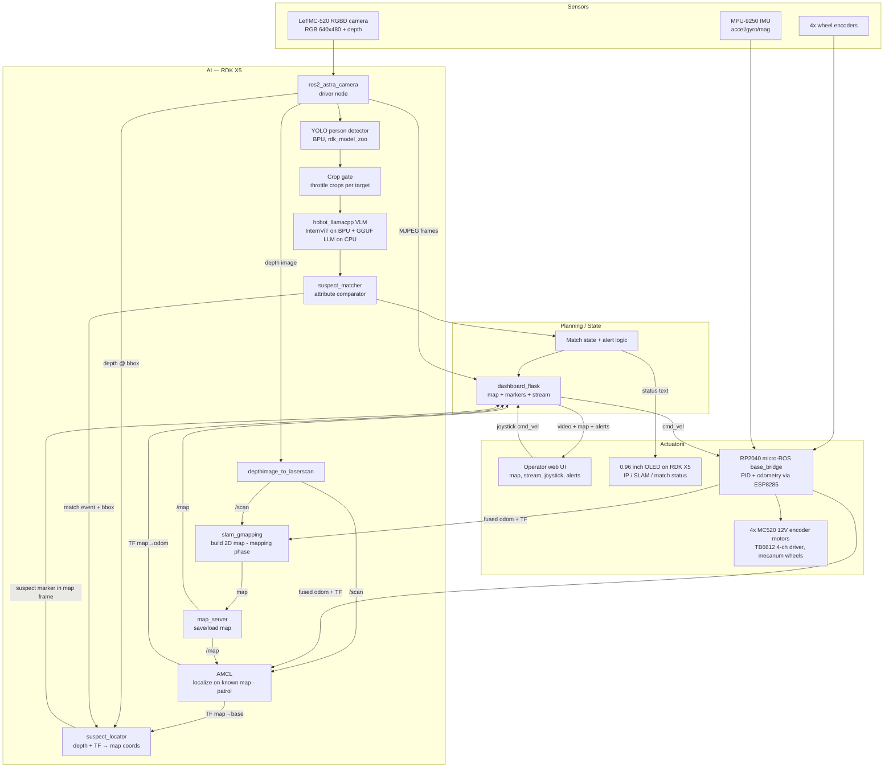
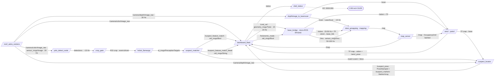

# VLM Police Patrol — Stage 2 Proposal (SLAM Edition)

- **Participant:** Brian
- **Stage completed:** 2 
- **Repository:** <https://github.com/zimbot97/VLM-Police-Patrol>

---

## Challenge 1 — Concept & Application Design

### Scenario

Indoor / semi-indoor patrol environments (office corridors, lobbies, warehouse aisles). Mixed artificial lighting, mostly flat floors suited to mecanum wheels. The robot patrols under operator supervision via a web dashboard on the same Wi-Fi network, while building and localizing within a 2D occupancy map (SLAM). When a suspect match occurs, the person's estimated position is marked on the map for the operator. All AI inference runs **on-device** on the RDK X5 — no cloud backend — so the system must operate within embedded compute and power budgets.

**Constraints & measurable targets:**

| Metric | Target |
|---|---|
| Person detection (YOLO on BPU) | ≥ 15 FPS end-to-end |
| VLM match cycle (InternVL2.5-1B, full attribute extraction + compare) | ~30 s per query overall |
| Dashboard video latency (MJPEG over LAN) | ≤ 500 ms |
| Teleop command latency (joystick → cmd_vel) | ≤ 200 ms |
| Continuous runtime on one battery charge | ≥ 45 min |
| Suspect match accuracy (clothing/hair attributes, test set) | ≥ 80% correct match/no-match decisions |
| SLAM map update rate (2D occupancy grid) | ≥ 1 Hz map publish, odom TF ≥ 20 Hz |
| Suspect map-marker position error | ≤ 1 m at ≤ 4 m detection range |

### User

Security personnel / patrol operators. Primary interaction is the **`dashboard_flask` web UI** on a phone or laptop: live camera stream, live SLAM map with robot pose and suspect markers, holonomic joystick teleop, suspect reference image upload, and match alerts. Secondary interaction: uploading or capturing a reference image of a person of interest ("suspect") for the robot to watch for.

### Core AI Capabilities

- **Perception:** LeTMC-520 RGBD camera → YOLO person detection on the RDK X5 BPU. The depth stream serves double duty: converted to a synthetic laser scan (`depthimage_to_laserscan`) for 2D SLAM, and sampled at the detection bbox center for suspect range estimation.
- **Decision:** `suspect_matcher` — a gated VLM pipeline. YOLO runs continuously; person crops are periodically forwarded to an on-device VLM (InternVL2.5-1B via `hobot_llamacpp`, InternViT vision encoder on BPU + GGUF LLM on CPU). The VLM extracts structured appearance attributes (clothing color/type, hairstyle) per image, and a programmatic comparator decides match / no-match against the reference. A full match cycle takes **~30 s overall** on-device, which is precisely why detection is gated: YOLO runs continuously in real time while the slow VLM is invoked only on throttled crops, keeping the system responsive.
- **Localization:** Two phases. **Mapping:** `slam_gmapping` builds a 2D occupancy map, which is saved with `map_server`. **Patrol:** the saved map is reloaded and **AMCL** (adaptive Monte-Carlo localization) provides the `map→odom` correction, localizing the robot against the known map. Both consume the synthetic laser scan and odometry; the odometry itself is wheel encoders fused with an **MPU-9250 9-axis IMU** on the RP2040 (accel + gyro + mag) for drift-corrected heading — important because mecanum strafing is prone to wheel slip. AMCL's pose estimate is what `suspect_locator` uses to place suspect markers in the map frame during patrol.
- **Actuation:** Holonomic mecanum base. RDK X5 publishes `cmd_vel`; an RP2040 microcontroller runs a **micro-ROS** node (`base_bridge`) that performs closed-loop PID wheel speed control, subscribes to `/cmd_vel`, and publishes wheel odometry directly as ROS 2 topics over the ESP8285 transport — fused with the MPU-9250 IMU for SLAM.

### Innovation / Differentiation

- **On-device VLM person re-identification on a low-cost embedded board** — most stock demos stop at object detection; this project uses a vision-language model for open-ended, attribute-based appearance matching without training a custom re-ID network.
- **Gated two-tier inference architecture** that reconciles a fast detector (real-time) with a slow VLM (seconds per query) on shared embedded compute — the detector gates which crops reach the VLM, keeping the system responsive.
- **Structured attribute extraction + programmatic comparison** (rather than free-form VLM "same person?" prompting), making match decisions explainable and tunable.
- **Suspect geolocation on a live map:** a positive VLM match is fused with RGBD depth and SLAM localization to drop a "suspect last seen here" marker in the map frame — turning an appearance match into an actionable location for the operator.
- **Full-stack integration:** custom web dashboard with holonomic teleop, live stream, SLAM map with suspect markers, and a color-coded attribute comparison table — not just terminal output.

---

## Challenge 2 — AI System Architecture

### 2.1 System Flow Diagram



### 2.2 Module Design

| Module | Responsibility | Inputs | Outputs | Failure modes & handling |
|---|---|---|---|---|
| `ros2_astra_camera` | LeTMC-520 driver: RGB + depth streams | USB (OpenNI depth `2bc5:0403`, UVC color `2bc5:0502`) | `/camera/color/image_raw`, `/camera/depth/...` | USB enumeration failure → udev rules + launch retry; stream stall → watchdog restarts node |
| YOLO detector | Person detection on BPU | RGB image topic | Detections (bboxes, class 0, confidence) | Model load failure → abort launch with clear log; low-light misses → confidence threshold tuning |
| Crop gate | Throttle person crops to VLM (per-target cooldown) | Detections + RGB frames | ROI crops (service/topic to VLM) | Queue overflow → drop oldest crops; no detections → idle, no VLM load |
| `hobot_llamacpp` VLM | Attribute extraction from crop (clothing, hairstyle) | ROI crop + prompt | `ai_msgs/PerceptionTargets` text result | Cold-load 300–650 s → deterministic ready-event before accepting queries; ION memory exhaustion → 512MB+ ION pool preset |
| `suspect_matcher` comparator | Parse structured attributes, compare vs reference, decide match | VLM outputs for reference + live crops | `/suspect_feature_match` (Bool), `/suspect_feature_match_detail` (String) | Malformed VLM output → parse guard, report "inconclusive" instead of false match |
| `depthimage_to_laserscan` | Convert RGBD depth to 2D `/scan` for SLAM | Depth image + camera info | `sensor_msgs/LaserScan` | Depth dropouts/noise → range clipping + scan filtering |
| `slam_gmapping` (mapping phase) | Build 2D occupancy map from scan + odom | `/scan`, odometry TF | `/map` (OccupancyGrid), `map→odom` TF | Odom slip on mecanum strafe → IMU-fused odometry + tune `srr/srt/str/stt`; large open spaces → increase particle count |
| `map_server` | Save map after mapping; serve saved map at patrol time | `/map` (save) / `.yaml`+`.pgm` (load) | `/map` latched | Missing/corrupt map file → fall back to re-run gmapping |
| `amcl` (patrol phase) | Localize robot against the known map | `/scan`, odometry TF, `/map` | `map→odom` TF, `/amcl_pose` | Kidnapped/lost → global relocalization (increase particles); poor convergence → set `/initialpose` from dashboard |
| `base_bridge` (micro-ROS on RP2040) | PID wheel control + fuse encoder counts and MPU-9250 IMU into `/odom` + `odom→base_link` TF; publishes directly as ROS 2 over ESP8285 | `/cmd_vel`, 4x encoder AB, MPU-9250 (I2C) | `/cmd_vel` sub; `/odom` (`nav_msgs/Odometry`), `/imu` (`sensor_msgs/Imu`), TF | micro-ROS agent disconnect → 300 ms cmd timeout stops motors, auto-reconnect; IMU I2C fault → fall back to encoder-only odom |
| `oled_status` | Drive 0.96" SSD1306 OLED on RDK X5 (I2C): show IP, SLAM/map state, suspect match status | robot state topics | I2C to SSD1306 | I2C bus error → log + skip frame, non-fatal |
| `suspect_locator` | Project matched detection into map frame, publish marker | Match event + bbox, depth image, TF tree | `/suspect_pose` (PoseStamped), `/suspect_markers` (MarkerArray) | Invalid depth at bbox → sample neighborhood median; TF unavailable → hold marker, retry |
| `dashboard_flask` | Web backend: MJPEG relay, live map + suspect marker rendering, SocketIO events, teleop bridge | Camera frames, `/map`, robot pose, `/suspect_markers`, match topics, browser joystick input | HTTP/WS to browser; `/cmd_vel`, `/holonomic_mode` | ROS spin starvation → `MultiThreadedExecutor` + `ReentrantCallbackGroup`; client disconnect → zero-velocity failsafe |

### 2.3 Compute Allocation

| Workload | Unit | Expected utilisation |
|---|---|---|
| YOLO person detection | **BPU** | Continuous; ~15–30 FPS budget |
| InternViT vision encoder (VLM vision tower) | **BPU** | Burst, on gated queries only |
| GGUF LLM backbone (InternVL2.5-1B) | **CPU** (4–6 cores during decode) | Burst; contributes to the ~30 s end-to-end match cycle, otherwise idle |
| `ros2_astra_camera` + image transport | CPU | ~10–20% of one core |
| `dashboard_flask` (MJPEG encode + SocketIO) | CPU | ~20–40% of one core |
| `slam_gmapping` (mapping only) | CPU | ~20–35% of one core (particle filter) |
| `amcl` (patrol only) | CPU | ~5–15% of one core |
| scan conversion (`depthimage_to_laserscan`) | CPU | ~5–10% of one core |
| `suspect_locator` (projection, event-driven) | CPU | negligible |
| ROS 2 middleware / comparator / gate | CPU | < 10% aggregate |
| Wheel PID + encoder counting + IMU fusion (micro-ROS) | **RP2040 (offloaded)** | Dedicated MCU, hard real-time |
| `oled_status` display (SSD1306 I2C) | CPU | negligible |
| Host offload | none | All inference on-device |

**Memory note:** ION pool configured ≥ 512 MB (`srpi-config`) to hold InternVL2.5-1B's ~431 MB vision encoder — the default 320 MB carveout is insufficient. Cold model loads are slow (observed ~312–651 s), so the node signals a deterministic ready-event before accepting queries.

### 2.4 ROS 2 Node Graph



**Services:** `/capture_crop` (`std_srvs/Trigger`) — capture current person crop; `/compare_images` (`std_srvs/Trigger`) — run reference-vs-live comparison.

| Module | Thread / process | Core affinity | Real-time constraint |
|---|---|---|---|
| YOLO detector | own process (BPU-bound) | default | soft RT, ≥ 15 FPS |
| `hobot_llamacpp` | own process | CPU decode threads capped to leave 2 cores free | none (batch) |
| `suspect_matcher` | own process, event-driven | default | none |
| `slam_gmapping` (mapping) | own process | default | soft RT: TF ≥ 20 Hz, map ~1 Hz |
| `amcl` (patrol) | own process | default | soft RT: `map→odom` TF ≥ 10 Hz |
| `suspect_locator` | own process, event-driven | default | marker within 1 s of match |
| `dashboard_flask` | Flask threads + `rclpy` `MultiThreadedExecutor` in background thread | default | teleop path ≤ 200 ms |
| `base_bridge` micro-ROS (PID + odom + IMU) | dedicated MCU | n/a | hard RT, 100 Hz+ control loop |
| `oled_status` | own process / timer | default | 2–5 Hz refresh, non-RT |

### 2.5 Robot Model (URDF)

A URDF description of the robot is authored for SLAM and visualization. It defines the TF tree that gmapping and `suspect_locator` depend on:

```
base_footprint → base_link → { camera_link, imu_link, laser_frame,
                               wheel_fl, wheel_fr, wheel_rl, wheel_rr }
```

- **`base_footprint` → `base_link`:** vertical offset to the chassis origin (axle height).
- **`camera_link`:** LeTMC-520 mount pose on the top layer — its extrinsics are what let `suspect_locator` project depth pixels into the map frame, so this transform is measured/calibrated, not guessed.
- **`imu_link`:** MPU-9250 mount orientation, so IMU axes align with `base_link`.
- **`laser_frame`:** virtual frame for the `depthimage_to_laserscan` output, coincident with the camera's optical axis.
- **wheel joints:** four continuous joints for the mecanum wheels (visualization + future kinematic reference).

The URDF is loaded via `robot_state_publisher` (with the `ParameterValue(Command([...]), value_type=str)` wrapper to stop launch from YAML-parsing the xacro output) and used in RViz2 and, optionally, streamed to the dashboard for a 3D pose view.

---

## Challenge 3 — Engineering Plan

### 3.1 BOM (Bill of Materials)

| # | Part | Qty | Supplier / SKU | Notes |
|---|---|---|---|---|
| 1 | D-Robotics RDK X5 | 1 | D-Robotics | Main compute, 10 TOPS BPU, 5V USB-C PD |
| 2 | LeTMC-520 3-in-1 RGBD camera | 1 | [tinydeals.net #76394](https://www.tinydeals.net/product/76394/letmc-520-somatosensory-camera-3-in-1-slam-develops-rgbd-depth-vision-camera-motion-sensing-camera/) | Astra-compatible; USB: depth `2bc5:0403` + UVC color `2bc5:0502`; driver `ros2_astra_camera` |
| 3 | Mecanum chassis, 3-layer, 80 mm yellow wheels | 1 | 麦轮全向底盘 (80黄麦轮) kit | Holonomic base; layers for battery / driver / compute |
| 4 | MC520P30_12V encoder gearmotor | 4 | MC520 series | 12 V, 1:30, 360±20 rpm, 1.5 kg·cm; AB hall encoder 13 PPR (390 counts/rev output); encoder 3.3–5 V; XH2.54 6-pin |
| 5 | TB6612 4-channel motor driver module w/ voltage regulator (紫色版, soldered headers) | 1 | — | Single board drives all 4 motors; onboard 5 V regulator; 12 V motor supply |
| 6 | RP2040 board (Pico) | 1 | Raspberry Pi Pico | Encoder counting + PID + mecanum mixing |
| 7 | ESP8285 module | 1 | — | micro-ROS transport (Wi-Fi/serial) between RP2040 `base_bridge` and the RDK X5 micro-ROS agent |
| 8 | MPU-9250 9-axis IMU (accel/gyro/mag) | 1 | — | I2C; fused with wheel odometry on RP2040 for SLAM (heading + slip correction) |
| 9 | 0.96" SSD1306 OLED (I2C, 128x64) | 1 | — | On RDK X5 I2C bus; shows IP / SLAM state / match status |
| 10 | Doublepow 11.1 V Li-ion 18650 pack, 5000 mAh, w/ protection board | 1 | Doublepow | Powers motors (12 V rail) + 5 V buck for RDK X5 |
| 11 | DC-DC buck converter 12 V → 5 V/5 A | 1 | generic | RDK X5 + camera power |
| 12 | Wiring, XH2.54 harnesses, standoffs, fasteners | — | generic | Encoder harnesses per motor pinout (M−, VCC, A, B, GND, M+); I2C leads for IMU + OLED |

*SLAM reuses the existing RGBD depth stream (via `depthimage_to_laserscan`) as the scan source. The two added components — the **MPU-9250 IMU** (odometry fusion / slip correction) and the **0.96" OLED** (on-robot status) — are low-cost I2C peripherals requiring no structural changes to the chassis.*

### 3.2 Timeline / Roadmap

Stage 1 (Ignite) was submitted **5 July**. This Stage 2 proposal is submitted **8 July**. Stage 3 (final build + demo) will be submitted **before 15 July**, giving a tight ~6-day execution window in which the hardware and software integration below runs largely in parallel.

| Date | Stage | Milestone |
|---|---|---|
| **Jul 5** | Stage 1 ✅ | Board bring-up submitted: RDK X5 flash + SSH, LeTMC-520 via `ros2_astra_camera`, YOLO on-device via `rdk_model_zoo`. |
| **Jul 6–8** | Stage 2 prep | Chassis assembled; motors + encoders wired to RP2040 + TB6612 4-ch driver; micro-ROS `base_bridge` (PID + mecanum mixing) bench-tested; MPU-9250 wired on I2C. |
| **Jul 8** | Stage 2 ✅ | This proposal (concept, architecture, engineering plan) submitted via PR. |
| **Jul 9–11** | Stage 3 build | `base_bridge` micro-ROS over ESP8285 on the live graph (`/cmd_vel`, `/odom`, `/imu`); IMU fused into odometry; dashboard joystick drives the base; URDF + `robot_state_publisher` TF tree in RViz2. |
| **Jul 12** | Stage 3 build | Camera extrinsics calibrated; `depthimage_to_laserscan` + `slam_gmapping` build the patrol map, saved via `map_server`; **AMCL** localizing on the saved map; map + pose rendered in dashboard; OLED status display up. |
| **Jul 13** | Stage 3 build | YOLO → crop gate → VLM pipeline on the moving robot; `suspect_locator` projecting matches into the map frame; suspect markers + alerts in dashboard. |
| **Jul 14** | Stage 3 polish | Accuracy + marker-position tuning; battery runtime test; failure hardening; demo scenario rehearsal, video recording, benchmark tables. |
| **Before Jul 15** | Stage 3 ✅ | Final documentation, demo video, and repo submitted. |

### 3.3 Risk Analysis (Top 7)

| # | Risk | Trigger (when to pivot) | Mitigation |
|---|---|---|---|
| 1 | VLM latency too high for useful patrol alerts | Match cycle exceeds ~30 s after tuning | Reduce crop resolution; shorten prompts; cache reference attributes once (compare live crops against cached reference, ~1 inference per query); fall back to a smaller VLM (e.g. SmolVLM2-256M) if InternVL2.5-1B can't hit the target |
| 2 | ION / memory exhaustion when detector + VLM co-run | Allocation failures reappear during integration | ION pool ≥ 512 MB preset; stagger model loads; fall back to sequential (pause detector during VLM decode) |
| 3 | Motor driver hardware fault (previously seen on a WHEELTEC D24A: 3.3 V rail failure from shorted TVS diode) | Any encoder rail reading < 3 V | Feed encoder VCC from Pico 3.3 V rail; keep a spare TB6612 4-channel board |
| 4 | Wi-Fi teleop dropouts cause runaway robot | Any uncommanded motion during W2 tests | 300 ms `cmd_vel` timeout on RP2040 → zero velocity; RC spike filter (N=3 consecutive samples) |
| 5 | Mecanum wheel odometry too noisy for SLAM (strafe slip) | Map distortion / TF drift during W3 tests | MPU-9250 IMU fused into odometry (heading from gyro/mag); tune gmapping `srr/srt/str/stt`; reduce strafe speed while mapping |
| 6 | AMCL fails to converge / robot gets "lost" during patrol | Pose jumps or drift in dashboard during Jul 12–13 tests | Seed `/initialpose` from dashboard at start; increase particle count; feature-sparse areas → rely more on odometry, slow down |
| 7 | Battery runtime below target with full AI + SLAM/AMCL load | Runtime test fails | Duty-cycle VLM queries; second battery pack in parallel; reduce MJPEG resolution/FPS |

### 3.4 GitHub Project Structure

```
VLM-Police-Patrol/
├── README.md
├── src/
│   ├── suspect_matcher/     # ament_python: VLM matching pipeline
│   ├── dashboard_flask/     # ament_python: web dashboard (map + markers)
│   ├── suspect_locator/     # match → map-frame suspect marker
│   ├── robot_description/   # URDF/xacro, meshes, robot_state_publisher launch
│   └── oled_status/         # SSD1306 status display node
├── firmware/
│   └── rp2040/              # micro-ROS: PID + encoder + IMU + mecanum mixing
├── launch/                  # bringup: base(micro-ros), camera, mapping(gmapping), localization(amcl), urdf, vlm, dashboard, oled
├── maps/                    # saved occupancy maps (.yaml + .pgm) for AMCL
├── models/                  # .bin (BPU) and .gguf model files / links
└── scripts/                 # flash, setup, test utilities
```

**Conventions:** ROS 2 Humble, `--merge-install` colcon layout (tros requirement); English for code, docs, and diagrams; one PR per feature branch.

---

*I agree that this proposal may be used by the Robotics Dream Keeper Challenge organizers as described in the official README (promotion, judging, and archives).*
