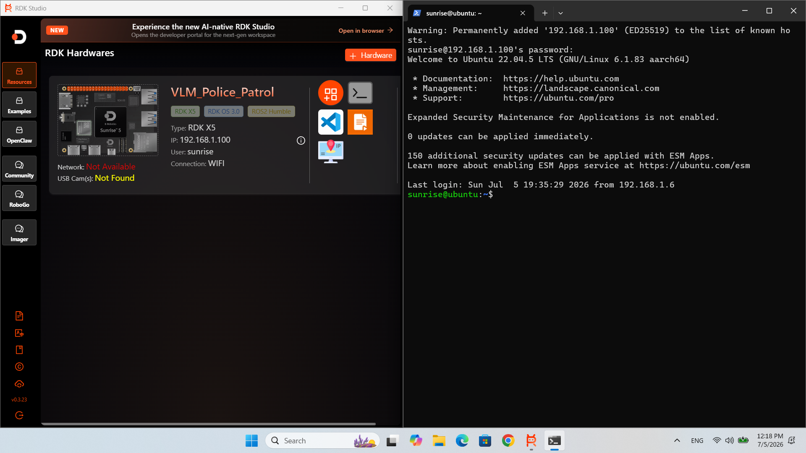
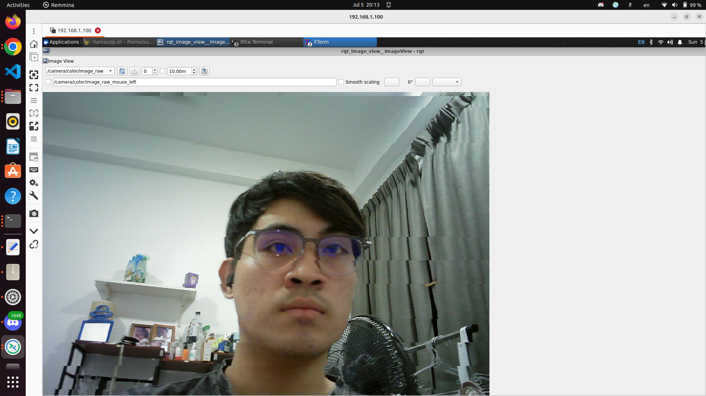
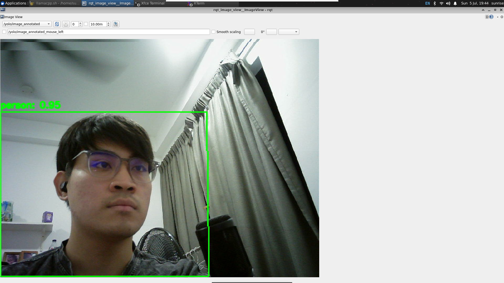

# VLM Police Patrol

- **Participant:** Brian
- **Stage completed:** <1 | 2 | 3>  <!-- fill in your current stage -->
- **Repository:** <https://github.com/zimbot97/VLM-Police-Patrol>
- **Demo video:** <https://...>  <!-- add your demo link -->
- **Community post:** <https://...>  <!-- optional -->

## Summary

VLM Police Patrol is a ROS 2 (Humble) autonomous patrol system built on a holonomic mecanum robot powered by the D-Robotics RDK X5. The project addresses the problem of scalable, low-cost person-of-interest monitoring in patrol scenarios by combining onboard vision-language model (VLM) inference with a real-time remote operator interface.

The system is composed of two ROS 2 packages. `suspect_matcher` runs a VLM-based person appearance matching pipeline using `hobot_llamacpp` (SmolVLM2 / InternVLM variants) alongside YOLO detection, split across the RDK X5's BPU and CPU to keep inference real-time on embedded hardware. `dashboard_flask` provides a live web dashboard for remote monitoring and teleoperation, streaming MJPEG camera feed and exposing holonomic joystick controls for the mecanum drivetrain.

Together, these let an operator remotely watch patrol footage and receive VLM-driven alerts when a person matching a target appearance description is detected in the camera feed — all running on embedded edge hardware rather than a cloud backend.

Currently the dashboard supports live streaming and joystick teleop, with YOLO capture and image-comparison features in active development. The `suspect_matcher` VLM pipeline is functional for appearance matching, with a gated detection pipeline (continuous YOLO detection + periodic VLM attribute matching) in progress to reduce inference load.

## Technical Highlights

- **Hardware:** D-Robotics RDK X5 (TROS Humble), mecanum/holonomic drive base
- **VLM inference:** `hobot_llamacpp` running SmolVLM2 / InternVLM variants, split BPU/CPU architecture for real-time performance
- **Detection:** YOLO-based person detection feeding into VLM appearance matching
- **ROS 2 graph:** camera driver → YOLO detection node → VLM matcher node (`suspect_matcher`) → dashboard backend (`dashboard_flask`) → web frontend
- **Dashboard:** Flask-based web UI with MJPEG camera streaming and holonomic joystick teleop controls
- **In progress:** gated YOLO + SmolVLM2 pipeline for continuous detection with periodic attribute matching; YOLO capture and image-comparison tab in the dashboard

## Links & Evidence

**Screenshot A — Board bring-up (flash + SSH):**

**Screenshot B — Sensor / actuator activity (camera):**

**Screenshot C — AI task running on board (YOLO detection):**

- Benchmarks: <...>

---

I agree that this showcase document may be used by the Robotics Dream Keeper Challenge organizers as described in the official README (promotion, judging, and archives).
